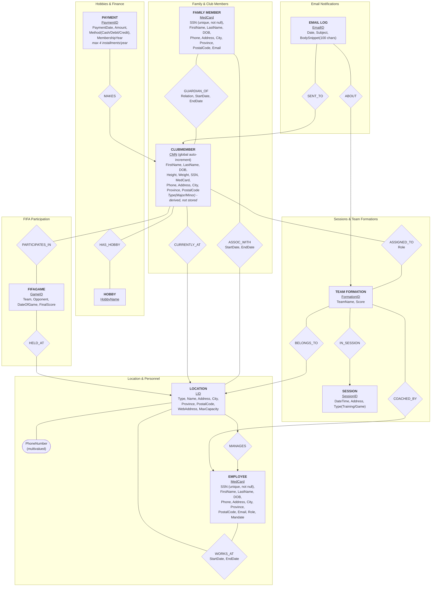

# A Simple Database Application for the Country Soccer Club System (CSCS)

---

**Legend**

- `(-->)` points to the entity on the "1" side of the relationship.
- Plain line `(--)` = M:N relationship, plain on both ends.
- `<u>` = primary/partial key. Diamond = relationship (attributes listed on the diamond if it carries data).

---

## Constraints

### Location

- One Head location; any number of Branches.
- Head location must have: General Manager, deputy manager, treasurer, secretary, ≥1 administrator.
- GM of the Head location = President of the club.
- `MaxCapacity` = cap on _active_ club members at that location.

### Employee (Personnel)

- `SSN` unique, **not null**, across all personnel.
- `MedCard` unique across all personnel.
- `Role` ∈ {Administrator, Captain, Coach, Assistant Coach, Other} — GM counts as Administrator.
- `Mandate` ∈ {Volunteer, Salaried}.
- One role at a time.
- One location at a time, but time-based over their career (`WORKS_AT` start/end date; null end = still active) — can return to a prior location in a later stint.

### Family Member

- One location at a time, time-based (`ASSOC_WITH`), same pattern as Employee.
- `Relation` ∈ {Father, Mother, Grandfather, Grandmother, Tutor, Partner, Friend, Other}.
- Can have multiple children as club members.

### Club Member

- `CMN` globally unique, auto-increment — **not** scoped per location.
- Major ≥ 18 years old; Minor = 4–17.
- Minimum age **4** at registration.
- Minor must be linked to ≥1 family member; that link can change over time (`GUARDIAN_OF` is time-based).
- Hobbies optional, must come from the fixed `Hobby` list.
- One location at a time (current only).
- Major/Minor is **derived** from DOB, not stored.

### Payment / Finance

- Annual fee: $100 (minor) / $200 (major).
- Max 4 installments per year.
- Excess over the fee cap in a year → **donation**, derived (`SUM(payment) − cap`), not stored.
- Prior year's fees not fully paid → **inactive**, derived, not stored.
- Inactive members cannot participate in any game or activity — enforced at application/trigger level, not a simple FK.

### FIFA Game

- Per member per game: team played with, opponent, date, location, final score.

### Session / Team Formation

- One session = exactly 2 teams.
- Each team tied to one location; the two teams can share or differ in location.
- All players on a team must be club members from that team's location.
- Roles are drawn from a fixed 11-value list (Goalkeeper, Right/Left fullback, Center back, Center back/sweeper, Defending/holding midfielder, Right midfielder/winger, Central midfielder, Striker, Attacking midfielder, Left winger).
- All players in one formation must be all-boys or all-girls — no mixing.
- Conflict rule: a player can't be assigned to two formations same day unless start times are ≥3 hours apart — violating assignment rejected.

### Email

- Sent every Sunday, for the coming week's sessions.
- Subject: team name + date/time (e.g. "Montreal Group 6 Saturday 18-July-2026 2:00 PM training session").
- Body: member's name + role, coach's name + email, session type, address.
- Log stores: date, sender (location name), receiver, subject, first 100 chars of body.
