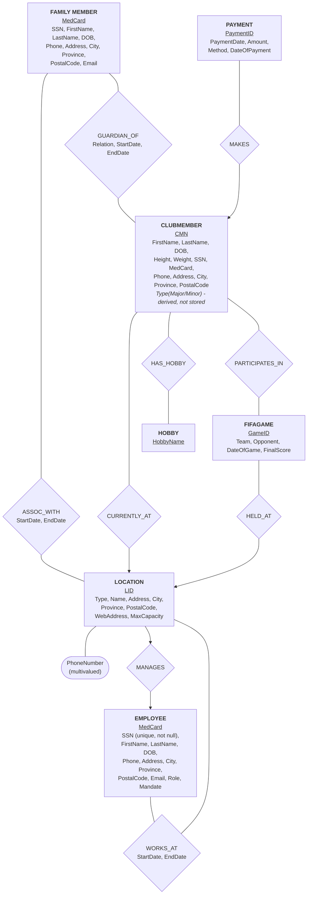

# A Simple Database Application for the Country Soccer Club System (CSCS)



##### **LEGEND**

- Rectangles represent entity sets;

- Diamonds represent **relationship sets;**

- Ovals represent **multivalued attributes;**

- **Primary key attributes are marked (PK);**

- Arrowheads point to the "1" side of a relationship; and

- Plain line marks the "many" side.

### Key Design Decisions

- The Personnel-to-Location and FamilyMember-to-Location associations are time-dependent (WORKS_AT, ASSOC_WITH); thus, each has its own associative table that has its own StartDate/EndDate attributes, as opposed to a foreign key column on the entity. That is because a person may change locations and all of this needs to be tracked.

- The association between ClubMember and FamilyMember (GUARDIAN_OF) is time-dependent and is M:N – that is, a minor club member can have different family members as his guardians at different periods of time, and one and the same family member can be the guardian of multiple club members.

- The FIFAGAME entity is a strong entity which has M:N association with the ClubMember entity through the PARTICIPATES_IN relationship. In this way, we can avoid repetition of the game information (opponent, score, date) for each individual participant

- ClubMember.Type (Major/Minor) and "active/inactive" attribute (membership status) are derived attributes, computed on demand based on DateOfBirth and payment history attributes, respectively. We do not want to store those in the database; otherwise, the data will get out-of-date.

- The CMN (membership number) attribute is a single, system-wide auto-increment attribute serving as a primary key.

# 2. Database Schema — DDL, Keys, and Relationships

The above E/R diagram has been transformed into relational forms using the standard transformation rules that include: An entity set is transformed to a table; A many-to-many or temporal relationship is transformed into a junction table which has either a composite key or surrogate key; A one-to-many relationship is transformed into a foreign key at the “many” end; and

### 2.1 Primary Keys

| **Table**                | **Primary Key**                   |
| ------------------------ | --------------------------------- |
| Location                 | location_id                       |
| LocationPhone            | (location_id, phone_number)       |
| Personnel                | personnel_id                      |
| PersonnelAssignment      | assignment_id                     |
| FamilyMember             | family_member_id                  |
| FamilyMemberAssignment   | assignment_id                     |
| ClubMember               | membership_number(AUTO_INCREMENT) |
| ClubMemberFamilyRelation | relation_id                       |
| Hobby                    | hobby_id                          |
| ClubMemberHobby          | (membership_number,hobby_id)      |
| Payment                  | payment_id                        |
| FIFAGame                 | game_id                           |
| FIFAParticipation        | (game_id,membership_number)       |

### 2.2 Foreign Keys

| **Table**                | **Foreign Key**   | **References** |
| ------------------------ | ----------------- | -------------- |
| PersonnelAssignment      | personnel_id      | Personnel      |
| PersonnelAssignment      | location_id       | Location       |
| FamilyMemberAssignment   | family_member_id  | FamilyMember   |
| FamilyMemberAssignment   | location_id       | Location       |
| ClubMember               | location_id       | Location       |
| ClubMemberFamilyRelation | membership_number | ClubMember     |
| ClubMemberFamilyRelation | family_member_id  | FamilyMember   |
| ClubMemberHobby          | membership_number | ClubMember     |
| ClubMemberHobby          | hobby_id          | Hobby          |
| Payment                  | membership_number | ClubMember     |
| FIFAParticipation        | membership_number | ClubMember     |
| FIFAParticipation        | game_id           | FIFAGame       |
| LocationPhone            | location_id       | Location       |

### 2.3 Constraints

- Personnel.ssn and FamilyMember.ssn are NOT NULL and UNIQUE, per the specification.

- Medicare numbers are UNIQUE for Personnel and FamilyMember (no two people share a Medicare card number).

- Personnel role is restricted to an ENUM of the roles named in the specification (General Manager, Deputy Manager, Treasurer, Secretary, Administrator, Captain, Coach, Assistant Coach, Other).

- Personnel mandate is restricted to ENUM('Volunteer', 'Salaried').

- Payment method is restricted to ENUM('Cash', 'Debit', 'Credit').

- ClubMember.membership_number is a global AUTO_INCREMENT primary key, unique across all locations.

- Foreign keys ensure referential integrity everywhere — no orphaned rows for assignments, payments, hobbies or game participation.

- DATE type is used for all date columns; DECIMAL(10,2) type is used for money columns; DECIMAL(5,2) type is used for height/weight columns.

### 2.4 Data Types Used

| **Data Type** | **Purpose**                                                           |
| ------------- | --------------------------------------------------------------------- |
| INT           | Primaryand foreign keys                                               |
| VARCHAR       | Names, addresses, emails, phonenumbers, SSN,Medicarenumbers           |
| DATE          | Birth dates,assignment dates, payment dates, game dates               |
| DECIMAL(10,2) | Payment amounts                                                       |
| DECIMAL(5,2)  | Height and weight                                                     |
| ENUM          | Personnel role,mandate, payment method,location type,relationshiptype |

# 3. Database Population

The database is populated using sql/02_seed.sql, inserted in an order that respects foreign-key dependencies (Location before ClubMember, ClubMember before Payment, etc.). The specification requires at least 10 representative tuples per table such that every query returns at least two rows.

### 3.1 Current Row Counts

| **Table**                | **Row Count** | **Meets≥10 requirement?** |
| ------------------------ | ------------- | ------------------------- |
| Location                 | 10            | Yes                       |
| LocationPhone            | 11            | Yes                       |
| Personnel                | 10            | Yes                       |
| PersonnelAssignment      | 10            | Yes                       |
| FamilyMember             | 10            | Yes                       |
| FamilyMemberAssignment   | 10            | Yes                       |
| ClubMember               | 10            | Yes                       |
| ClubMemberFamilyRelation | 10            | Yes                       |
| Hobby                    | 10            | Yes                       |
| ClubMemberHobby          | 18            | Yes                       |
| Payment                  | 18            | Yes                       |
| FIFAGame                 | 10            | Yes                       |
| FIFAParticipation        | 29            | Yes                       |

### 3.2 Seed Data (02_seed.sql)

| `-- =========================================================`<br>`-- CSCS (Country Soccer Club System) - Seed Data` |
| -------------------------------------------------------------------------------------------------------------------- |
| `-- Insert order respects FK dependencies:`                                                                          |
| `-- Location -> LocationPhone`                                                                                       |
| `-- Personnel -> PersonnelAssignment`                                                                                |
| `-- FamilyMember -> FamilyMemberAssignment`                                                                          |
| `-- Location -> ClubMember -> ClubMemberFamilyRelation`                                                              |
| `-- Hobby -> ClubMemberHobby`                                                                                        |
| `-- ClubMember -> Payment`                                                                                           |
| `-- Location -> FIFAGame -> FIFAParticipation`                                                                       |

# 4. Table Verification — SELECT COUNT(\*) FROM R

The output of "SELECT COUNT(\*) FROM R;" for each relation R that is formed in the database is listed below. This has been done using sql/04_verify.sql on the local development database (which matches the AITS wqc353_1 database schema).

| **Relation (R)**         | **COUNT(\*)** |
| ------------------------ | ------------- |
| Location                 | 10            |
| LocationPhone            | 11            |
| Personnel                | 10            |
| PersonnelAssignment      | 10            |
| FamilyMember             | 10            |
| FamilyMemberAssignment   | 10            |
| ClubMember               | 10            |
| ClubMemberFamilyRelation | 10            |
| Hobby                    | 10            |
| ClubMemberHobby          | 18            |
| Payment                  | 18            |
| FIFAGame                 | 10            |
| FIFAParticipation        | 29            |

Verification Script (04_verify.sql)

```sql
USE wqc353_1;

SELECT 'Location' AS table_name, COUNT(*) AS row_count FROM Location
UNION ALL SELECT 'LocationPhone', COUNT(*) FROM LocationPhone
UNION ALL SELECT 'Personnel', COUNT(*) FROM Personnel
UNION ALL SELECT 'PersonnelAssignment', COUNT(*) FROM PersonnelAssignment
UNION ALL SELECT 'FamilyMember', COUNT(*) FROM FamilyMember
UNION ALL SELECT 'FamilyMemberAssignment', COUNT(*) FROM FamilyMemberAssignment
UNION ALL SELECT 'ClubMember', COUNT(*) FROM ClubMember
UNION ALL SELECT 'ClubMemberFamilyRelation', COUNT(*) FROM ClubMemberFamilyRelation
UNION ALL SELECT 'Hobby', COUNT(*) FROM Hobby
UNION ALL SELECT 'ClubMemberHobby', COUNT(*) FROM ClubMemberHobby
UNION ALL SELECT 'Payment', COUNT(*) FROM Payment
UNION ALL SELECT 'FIFAGame', COUNT(*) FROM FIFAGame
UNION ALL SELECT 'FIFAParticipation', COUNT(*) FROM FIFAParticipation;
```
