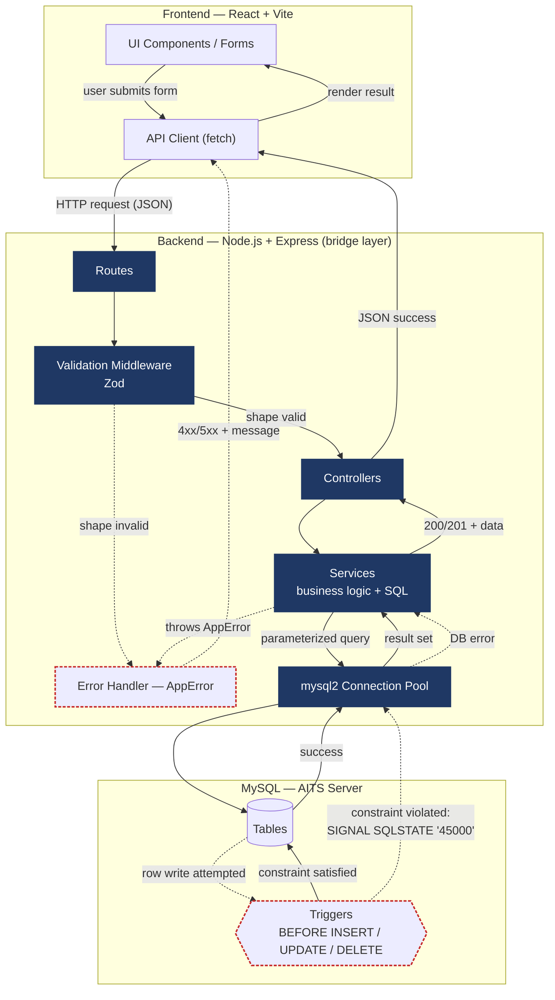

```mermaid
flowchart TD

subgraph CLIENT["Frontend — React + Vite"]
    UI["UI Components / Forms"]
    FETCH["API Client (fetch)"]
end

subgraph SERVER["Backend — Node.js + Express (bridge layer)"]
    ROUTES["Routes"]
    VALIDATE["Validation Middleware<br /> Zod"]
    CONTROLLERS["Controllers"]
    SERVICES["Services <br />business logic + SQL"]
    ERRHANDLER["Error Handler — AppError"]
    POOL["mysql2 Connection Pool"]
end

subgraph DB["MySQL — AITS Server"]
    TABLES[("Tables")]
    TRIGGERS{{"Triggers\nBEFORE INSERT / UPDATE / DELETE"}}
end

UI -->|"user submits form"| FETCH
FETCH -->|"HTTP request (JSON)"| ROUTES
ROUTES --> VALIDATE
VALIDATE -->|"shape valid"| CONTROLLERS
VALIDATE -.->|"shape invalid"| ERRHANDLER
CONTROLLERS --> SERVICES
SERVICES -->|"parameterized query"| POOL
POOL --> TABLES
TABLES -.->|"row write attempted"| TRIGGERS
TRIGGERS -->|"constraint satisfied"| TABLES
TRIGGERS -.->|"constraint violated:\nSIGNAL SQLSTATE '45000'"| POOL
TABLES -->|"success"| POOL
POOL -->|"result set"| SERVICES
POOL -.->|"DB error"| SERVICES
SERVICES -->|"200/201 + data"| CONTROLLERS
SERVICES -.->|"throws AppError"| ERRHANDLER
CONTROLLERS -->|"JSON success"| FETCH
ERRHANDLER -.->|"4xx/5xx + message"| FETCH
FETCH -->|"render result"| UI

classDef success stroke:#2e7d32,stroke-width:2px
classDef error stroke:#c62828,stroke-width:2px,stroke-dasharray: 4 2
classDef layer fill:#1F3864,color:#ffffff,stroke:#1F3864

class ROUTES,VALIDATE,CONTROLLERS,SERVICES,POOL layer
class ERRHANDLER error
class TRIGGERS error
```
