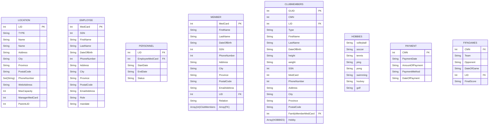

```mermaid
erDiagram

    LOCATION {
        Int LID PK
        String TYPE
        String Name
        String Name
        String Address
        String City
        String Province
        String PostalCode
        Set(String) PhoneNumber
        String WebAddress
        Int MaxCapacity
        Int ManagerMedCard
        Int ParentLID
    }

    EMPLOYEE {
        Int MedCard PK
        Int SSN
        String FirstName
        String LastName
        String DateOfBirth
        Int PhoneNumber
        String Address
        String City
        String Province
        String PostalCode
        String EmailAddress
        String Role
        String mandate
    }

    PERSONNEL{
        Int LID FK
        Int EmployeeMedCard FK
        String StartDate
        String EndDate
        String Status
    }

    MEMBER{
        Int MedCard PK
        String FirstName
        String LastName
        String DateOfBirth
        Int SSN
        Int PhoneNumber
        String Address
        String City
        String Province
        String PostalCode
        String EmailAddress
        Int LID FK
        String Relation
        Array(int)ClubMembers Array(FK)
    }

    CLUBMEMBERS{
        Int GUID PK
        Int CMN
        Int LID FK
        String Type
        String FirstName
        String LastName
        String DateOfBirth
        String height
        String weight
        Int SSN
        Int MedCard
        Int PhoneNumber
        String Address
        String City
        String Province
        String PostalCode
        Int FamilyMemberMedCard FK
        Array(HOBBIES) Hobby
    }

    HOBBIES{
        String volleyball
        String soccer
        String tennis
        String ping
        String pong
        String swimming
        String hockey
        String golf
    }

    PAYMENT{
        Int CMN FK
        String PaymentDate
        String AmountOfPayment
        String PaymentMethod
        String DateOfPayment
    }

    FIFAGAMES{
        Int CMN FK
        String Team
        String Opponent
        String DateOfGame
        Int LID FK
        String FinalScore
    }
```
