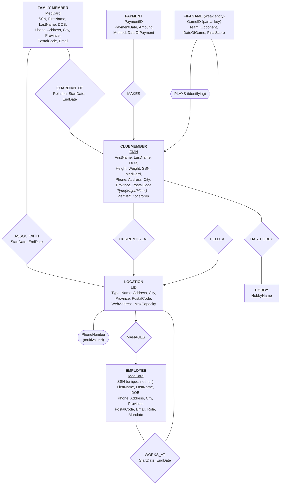

# Comp 353 - WarmUp Project

## Authors:

## ER Model

**Legend**

- ArrowHead `(-->)` points to the entity on the "1" side of the relationship. (e.g `MEMBER --- GUARDIAN`)
- Plain line `(--)` means M:N relationship have plain lines on both ends. (e.g `MANAGES --> EMPLOYEE`)
- `<u>` Underlined + labeled "(partial key)" = weak entity's partial key (Depends on a strong owner)
- Double-bordered diamond on `PLAYS` = identifying relationship for the weak entity FIFAGAME (it can't exist without a ClubMember).
- `PhoneNumber` on Location is drawn as a multivalued attribute (oval), as a location may have multiple numbers.

**Limitations:**

The EMPLOYEE and MEMBER (family member) are seperate entities with duplicate attribute sets (SSN, name, contact, info, etc). However; if the same physical person is both an employee and a family member, then this will result in duplicate information and there would be no way to inforce the `same SSN = same person`.

- To address this issue, we'll keep them seperate and accept the duplication risk.
